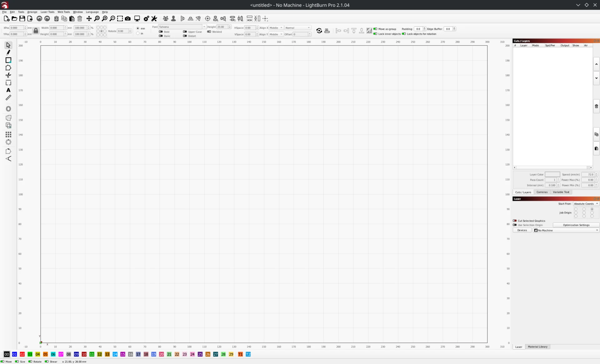

# lightburn-on-linux

Run LightBurn 2.x on Linux with Wine and a small WinRT camera shim.
Unofficial project, not affiliated with LightBurn Software.

[](assets/lightburn-linux.webp)

LightBurn 2.1.04 opened and activated its normal trial in the original local
check with Wine 11.17. The shim returns an empty camera list to avoid a startup
crash. **Cameras are unsupported. Laser hardware has not been tested.**

The same shim also passed unactivated startup and shutdown with 2.1.00.
Version 2.0.05 needed Wine's Winmgmt service started first, which is not yet
automated by the launcher. See [compatibility results](COMPATIBILITY.md).

## Install

You need x86_64 Linux, Bash, GNU coreutils, Wine with `wineboot`, and an X11 or
Xwayland desktop. Building the shim requires an x86_64 MinGW cross-compiler
with the `windowsapp` import library. Set `CC` if it is not on `PATH` or at
`/opt/llvm-mingw/bin/x86_64-w64-mingw32-gcc`.

Download the official [LightBurn 2.1.04 Windows installer](https://files.release.lightburnsoftware.com/LightBurn/Release/LightBurn-v2.1.04/LightBurn-v2.1.04.exe)
and review its EULA before installing. You need a valid license or authorized
trial. Do not run these scripts with `sudo`.

```bash
./scripts/install.sh "$HOME/Downloads/LightBurn-v2.1.04.exe"
./scripts/run.sh
```

Installation checks the SHA-256 in `versions.env`, builds the shim, and sets up
the Wine prefix. Headless installation also needs `xvfb-run`, Xvfb, and `xauth`.
Launching LightBurn requires a desktop display.

Run `./scripts/install.sh` without an installer to repair an existing setup.
Launch and repair use the installed application, regardless of the default version.
An interrupted application install requires the installer again. Existing
installations are not automatically upgraded.

## Usage

```bash
./scripts/run.sh "/path/to/project.lbrn2"
./scripts/map-serial.sh /dev/ttyUSB0 com1
```

Prefer `/dev/serial/by-id/...` for a stable device path. Your user must have
read/write access to the device. The serial script creates a COM mapping; it
does not change permissions or verify communication with a laser.

Set an absolute `WINEPREFIX` to choose where application data lives. Otherwise,
scripts reuse an existing `.work/wineprefix` or default to
`${XDG_DATA_HOME:-$HOME/.local/share}/lightburn-on-linux/wineprefix`.
Nothing migrates or deletes an existing prefix. Back it up before changing versions.

Logs append to `install.log` and `run.log` under
`${XDG_STATE_HOME:-$HOME/.local/state}/lightburn-on-linux`.
Wine output goes to the log, not the terminal.

## Development

```bash
./shim/build.sh /existing/output/directory/winrtcamstub.dll
bash tests/run.sh
```

Set `WINRTCAMSTUB_DLL` to use a prebuilt shim during installation instead of
compiling it. Version and checksum defaults live in `versions.env` and can be
overridden through the environment. Unknown versions require an explicit installer
SHA-256. See [testing another version](COMPATIBILITY.md#testing-another-version).

GitHub Actions checks Bash syntax, ShellCheck, isolated shell tests, and a real
MinGW build with PE/export checks. A separate job tests the shim's COM interfaces
under Wine in a sandbox. Tests do not run LightBurn, activate a license, or test
laser hardware. CI does not publish binaries.

Run `bash tests/shim-com.sh` for the COM tests. They also require Wine, Bubblewrap,
Xvfb, and `xauth`. Test artifacts stay in `.cache/`, outside Git.

## License

Original project code is [MIT](LICENSE). LightBurn and third-party components
retain their own licenses. No LightBurn installer is included.

This repository publishes source code, not a prebuilt shim. The original
debugging work still raises unresolved EULA questions. See [LEGAL.md](LEGAL.md)
for the review and its limits.
